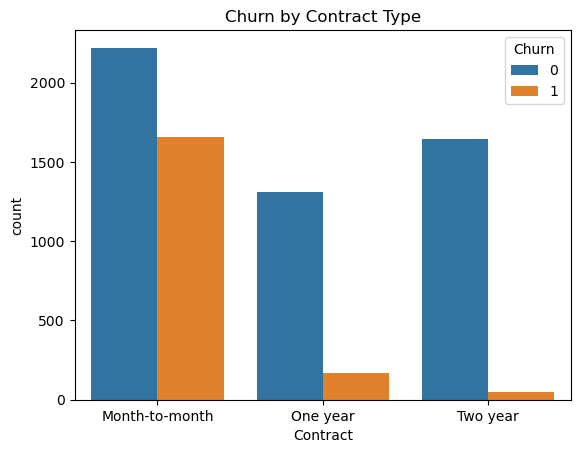
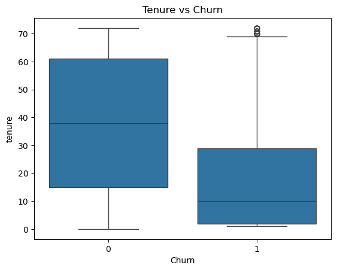
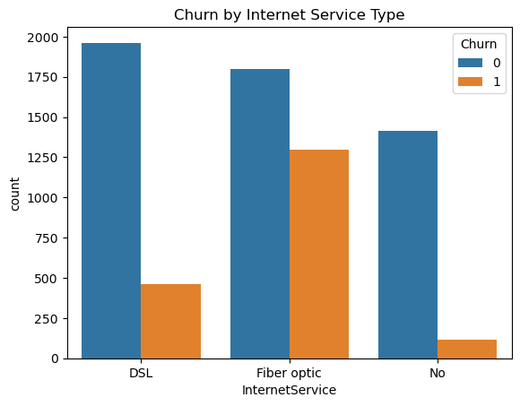
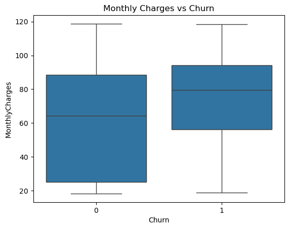
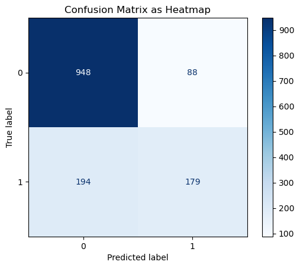
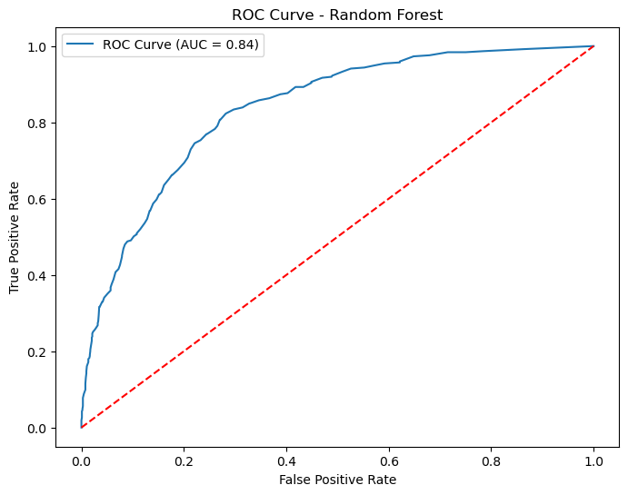
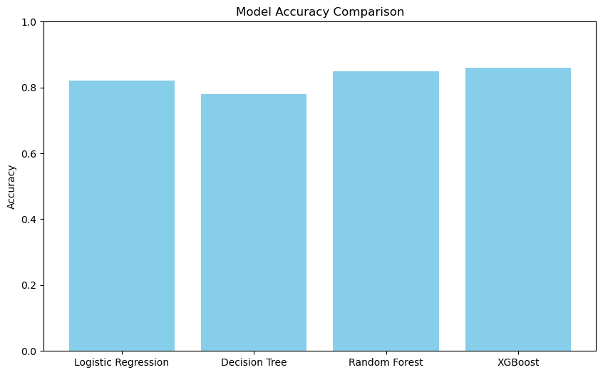
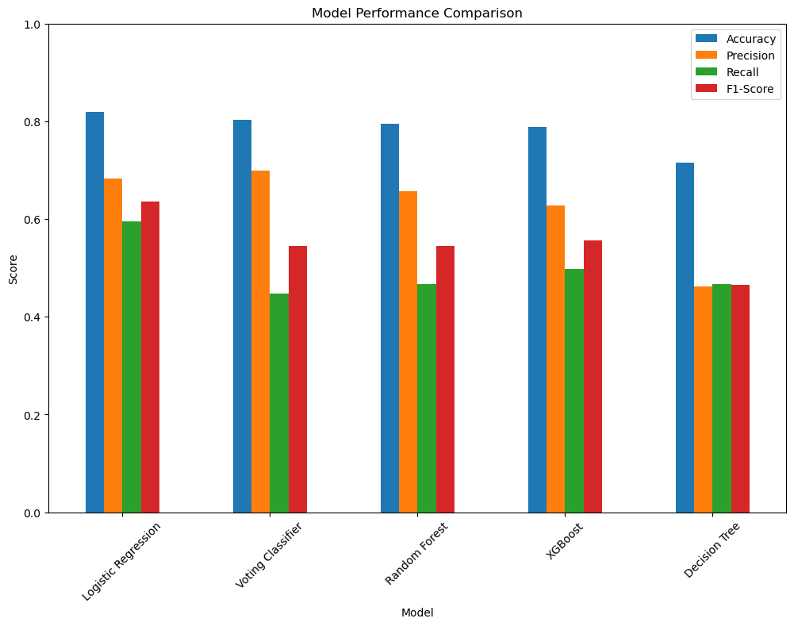

# Telco Customer Churn Prediction & Analysis
A complete machine learning and analytics project using the Telco Customer Churn dataset.
This project covers data cleaning, exploratory analysis, churn pattern visualizations, multiple ML model comparisons, feature importance insights, and saving the best model for future use.

📁 Project Structure
data/ — Raw input CSV file(s)

notebooks/ — Jupyter Notebook(s) for EDA and modeling

outputs/ — Saved plots and figures

models/ — Trained model file (best_model.pkl)

README.md — Project overview and instructions

requirements.txt — Python dependencies

.gitignore — Files and folders to exclude from version control

🛠 Tools & Technologies
Python (Pandas, NumPy, Seaborn, Matplotlib)

Scikit-learn, XGBoost

Jupyter Notebook

Git and GitHub

🔍 Key Features
Data cleaning and preprocessing

Exploratory Data Analysis with multiple churn visualizations

Multiple machine learning models: Logistic Regression, Decision Tree, Random Forest, XGBoost, Voting Classifier

Confusion Matrix and ROC Curve visualizations

Feature Importance analysis using Random Forest

Saved best model for deployment (best_model.pkl)

Model performance comparison chart

📦 How to Run
Clone the repository to your local machine

Install all required Python libraries listed in requirements.txt

Open the Jupyter Notebook in the notebooks folder

Run the notebook to reproduce analysis, visualizations, and model training

Explore all output plots and results in the outputs folder

Use the saved model for predictions on new customer data

📈 Insights & Recommendations
Customers with month-to-month contracts and high monthly charges have higher churn rates.

Shorter tenure indicates a higher probability of churn — retaining new customers is key.

The type of internet service and additional services influence churn likelihood.

Among all models tested, Random Forest performed the best with an accuracy of about 82%.

## 📊 Visualization Previews

### Churn by Contract Type  

### Tenure vs Churn  

### Churn by Internet Service  

### Monthly Charges vs Churn  

### Confusion Matrix Heatmap  

### ROC Curve (Random Forest)  

### Feature Importance (Random Forest)  
.png)

### Model Accuracy Comparison

### Model Performace Comparison  

## 📈 Key Insights

✅ **Contract Type:**  
Customers with **month-to-month contracts** churn at a much higher rate than those with longer-term contracts. Encouraging annual or two-year contracts could reduce churn.

✅ **Tenure & Charges:**  
Customers with **short tenure and high monthly charges** are more likely to leave. Targeting new customers with loyalty programs and better pricing could improve retention.

✅ **Internet Service:**  
Fiber optic users show higher churn — improving service reliability may help keep these customers.

✅ **Feature Importance (Random Forest):**  
The Random Forest model highlights **Contract Type, Tenure, and Monthly Charges** as the most influential factors driving churn.

✅ **Model Accuracy Comparison:**  
Among all tested models, **Random Forest** achieved the highest accuracy, making it the most reliable for this churn prediction task.

✅ **Model Performance Comparison:**  
Random Forest balanced **precision, recall, and ROC AUC** the best, showing strong generalization and prediction consistency.

✅ **Recommendation:**  
Deploy the churn prediction model to proactively identify at-risk customers and implement targeted retention strategies to reduce churn and boost revenue.

